# Architecture Documentation

**Version**: 4.0.0
**Last Updated**: 2025-10-27

## Table of Contents

- [Overview](#overview)
- [Architectural Principles](#architectural-principles)
- [System Architecture](#system-architecture)
- [Component Design](#component-design)
- [Concurrency Model](#concurrency-model)
- [Sequence Diagrams](#sequence-diagrams)
- [State Management](#state-management)
- [Design Rationale](#design-rationale)

---

## Overview

The ReportPortal Swift XCTest Agent v4.0 is a **parallel-execution-first** test reporting framework built on Swift Concurrency primitives. The architecture enables multiple test bundles and test cases to execute concurrently while maintaining proper test hierarchy and reporting consistency in ReportPortal.

### Key Capabilities

- **Parallel Execution**: Support for up to 10 concurrent test operations
- **Thread Safety**: Actor-based isolation for all shared mutable state
- **Non-Blocking**: Async/await throughout, zero blocking operations
- **Race-Free**: Atomic launch creation, reference-counted finalization
- **Observable**: Structured logging with correlation IDs for debugging

---

## Architectural Principles

### 1. Minimal State Management

**Principle**: Keep state management as simple as possible - only store what's absolutely necessary.

**Implementation**:
- `LaunchManager` (Singleton) - Simple UUID storage with lazy initialization
- `OperationTracker` (Actor) - Active test/suite operation registry for correlation

**Rationale**: Single bundle execution doesn't need complex state tracking. LaunchManager reduced from ~180 lines to 26 lines by removing unnecessary features (bundle counting, status aggregation, finalization flags).

### 2. Value Semantics for Operations

**Principle**: Test and suite operations are value types (structs), ensuring no shared state between concurrent operations.

**Implementation**:
- `TestOperation` (struct) - Immutable test execution context
- `SuiteOperation` (struct) - Immutable suite execution context

**Rationale**: Value types are copied on assignment, preventing unintentional sharing across threads.

### 3. Non-Blocking Async Operations

**Principle**: No operation blocks a thread waiting for I/O or synchronization.

**Implementation**:
- All network calls use `async/await`
- Task-based coordination replaces semaphores
- Exponential backoff for polling operations

**Rationale**: Blocking operations cause priority inversion and thread pool exhaustion in parallel execution.

### 4. Custom UUID Strategy

**Principle**: Generate launch UUID immediately client-side instead of waiting for ReportPortal API response.

**Implementation**:
- LaunchManager generates UUID on first access (lazy var)
- UUID available synchronously - no async waiting needed
- ReportPortal launch creation happens asynchronously in background
- Pass custom UUID to ReportPortal API via optional `uuid` parameter

**Rationale**: Eliminates complex synchronization logic, race conditions, and timeout handling. Launch ID is immediately available for all test operations.

### 5. Structured Concurrency

**Principle**: Task ownership and cancellation are explicit, following Swift Concurrency best practices.

**Implementation**:
- Tasks created by callers, passed to actors
- Unused tasks are explicitly cancelled
- Task sharing for coordinated operations

**Rationale**: Avoids `@escaping` closures, makes concurrency boundaries explicit, enables proper cancellation.

---

## System Architecture

### High-Level Component Diagram


### Data Flow Architecture


---

## Component Design

### Core Components

#### 1. RPListener (Observer)

**Responsibility**: Observes XCTest lifecycle events and coordinates reporting.

**Type**: `class` (must conform to NSObject for XCTestObservation)

**Key Methods**:
- `testBundleWillStart(_:)` - Generates custom launch UUID, creates launch in ReportPortal asynchronously
- `testSuiteWillStart(_:)` - Registers suite operation, starts suite in RP
- `testCaseWillStart(_:)` - Registers test operation, starts test in RP
- `testCaseDidFinish(_:)` - Finishes test in RP
- `testSuiteDidFinish(_:)` - Finishes suite in RP
- `testBundleDidFinish(_:)` - Finalizes launch (called once per bundle)

**Concurrency**: Spawns Tasks for async operations (XCTest callbacks are synchronous)

#### 2. LaunchManager (Singleton Class)

**Responsibility**: Minimal UUID storage for launch identification.

**Type**: `final class` (singleton)

**State**:
```swift
private(set) lazy var launchID: String = {
    let uuid = UUID().uuidString
    Logger.shared.info("📦 Launch initialized with UUID: \(uuid)")
    return uuid
}()
```

**Key Features**:
- **No methods needed** - Direct property access: `LaunchManager.shared.launchID`
- **Lazy initialization** - UUID generated on first access
- **Thread-safe** - Swift guarantees lazy var initialization happens once
- **Immutable** - Once set, never changes

**Design Evolution**: Reduced from ~180 lines (with actor isolation, bundle counting, status aggregation) to 26 lines by removing unnecessary features for single-bundle execution.

**Concurrency**: No actor isolation needed - property is read-only after initialization

#### 3. OperationTracker (Actor)

**Responsibility**: Registry of active test/suite operations for concurrent access.

**Type**: `actor` (singleton)

**State**:
```swift
private var testOperations: [String: TestOperation] = [:]
private var suiteOperations: [String: SuiteOperation] = [:]
```

**Key Methods**:
- `registerTest(_:identifier:)` - Add test to registry
- `getTest(identifier:)` - Retrieve test operation
- `updateTest(_:identifier:)` - Update test state
- `unregisterTest(identifier:)` - Remove completed test (cleanup)
- Similar methods for suite operations

**Concurrency**: Actor isolation prevents concurrent dictionary mutations

#### 4. ReportingService (Stateless Service)

**Responsibility**: Async API client for ReportPortal operations.

**Type**: `class` (stateless, no instance variables)

**Key Methods**:
```swift
func startLaunch(name:tags:attributes:) async throws -> String
func finalizeLaunch(status:) async throws
func startSuite(operation:launchID:) async throws -> String
func finishSuite(operation:) async throws
func startTest(operation:launchID:) async throws -> String
func finishTest(operation:) async throws
func postLog(message:level:) async throws
```

**Concurrency**: All methods are `async`, no blocking operations

#### 5. TestOperation & SuiteOperation (Value Types)

**Responsibility**: Immutable context for test/suite execution.

**Type**: `struct` (value semantics)

**TestOperation Fields**:
```swift
let correlationID: UUID        // For log tracing
var testID: String             // ReportPortal test ID
let suiteID: String            // Parent suite ID
let testName: String
let className: String
var status: TestStatus
let startTime: Date
let metadata: [String: String]
var attachments: [Data]
```

**Concurrency**: Value types are inherently thread-safe (copied on assignment)

---

## Concurrency Model

### Actor Isolation Model


### Task Lifecycle


---

## Sequence Diagrams

### 1. Launch Creation (Custom UUID Strategy)


**Key Benefits**:
- **No race conditions** - UUID generated once, thread-safe by Swift
- **No waiting** - UUID available synchronously
- **No coordination** - No task management or timeout logic
- **Simple** - LaunchManager reduced from 180 lines to 26 lines

### 2. Parallel Test Execution Flow


### 3. Launch Finalization (Reference Counting)

```mermaid
sequenceDiagram
    participant B1 as Test Bundle
    participant LM as LaunchManager
    participant RS as ReportingService
    participant RP as ReportPortal API

    Note over B1: Bundle starts
    B1->>LM: Access launchID (first time)
    activate LM
    LM->>LM: Generate UUID()<br/>lazy initialization
    LM-->>B1: UUID string
    deactivate LM

    B1->>RS: startLaunch(uuid: launchID)
    RS->>RP: POST /launch (with custom UUID)
    Note over RS: Fire and forget<br/>(async background task)

    Note over B1: Tests execute...

    Note over B1: Bundle finishes
    B1->>LM: Get launchID
    LM-->>B1: UUID string

    B1->>RS: finalizeLaunch(launchID, status: .passed)
    Note over RS: ReportPortal calculates<br/>actual status from tests
    RS->>RP: PUT /launch/uuid/finish
    RP-->>RS: ✓ Finished
    RS-->>B1: ✓

    Note over B1: Launch finalized<br/>(single bundle execution)
```



**Key Simplifications**:
- **No bundle counting** - Single bundle only
- **No status aggregation** - ReportPortal server calculates
- **No finalization flags** - testBundleDidFinish called exactly once
- **Custom UUID** - Generated immediately, no waiting for API

### 4. Error Handling Flow

```mermaid
sequenceDiagram
    participant T as Test
    participant LM as LaunchManager
    participant RS as ReportingService
    participant RP as ReportPortal API
    participant L as Logger

    Note over T: Test execution starts

    T->>LM: await getLaunchID()
    LM->>LM: Check launchID
    alt Launch exists
        LM-->>T: "abc123" ✓
    else Launch not ready
        LM-->>T: nil
        T->>L: error("Launch ID not available")
        Note over T: Test skips reporting<br/>but continues execution
    end

    T->>RS: startTest(...)
    RS->>RP: POST /item

    alt API Success
        RP-->>RS: { "id": "test-001" }
        RS-->>T: "test-001" ✓
    else Network Error
        RP--xRS: Error -1005 (connection lost)
        RS-->>T: throw NetworkError
        T->>L: error("Failed to start test", correlationID)
        Note over T: Error logged<br/>Test continues<br/>Other tests unaffected
    end

    Note over T: Test executes (isolated)

    T->>RS: finishTest(...)
    RS->>RP: PUT /item/test-001

    alt API Success
        RP-->>RS: ✓ Finished
        RS-->>T: ✓
        T->>L: info("Test finished", correlationID)
    else Launch ID Missing
        RS-->>T: throw LaunchIDNotFoundError
        T->>L: error("Failed to finish test: Launch ID not found")
        Note over T: Error isolated<br/>to this test only
    end
```



---

## State Management

### LaunchManager State Transitions


### TestOperation Lifecycle


---

## Design Rationale

### Why Actor-Based Concurrency?

**Problem**: Traditional locks (NSLock, DispatchQueue) require manual synchronization and are error-prone in concurrent code.

**Solution**: Swift Actors provide:
- **Compile-time safety**: Data races caught at compile time
- **Automatic synchronization**: Runtime handles locking
- **Deadlock prevention**: Actor reentrancy prevents self-deadlock
- **Clear isolation boundaries**: `await` makes async points explicit

**Trade-off**: All actor calls require `await`, adding suspension points. Acceptable because network operations already suspend.

### Why Task Sharing Over Closures?

**Problem**: Original design used `@escaping () async throws -> String` closure, mixing old-school escaping semantics with modern async/await.

**Solution**: Pass `Task<String, Error>` directly:
```swift
// Caller creates task
let task = Task { try await createLaunch() }

// Actor decides: use it, cancel it, or await existing
await actor.getOrAwaitLaunchID(launchTask: task)
```

**Benefits**:
- No `@escaping` needed (cleaner API)
- Task ownership explicit
- Easier cancellation (unused tasks cancelled explicitly)
- Idiomatic structured concurrency

### Why Reference Counting Over "Final Bundle" Flag?

**Problem**: v3.x used `IsFinalTestBundle` flag in Info.plist to determine which bundle should finalize launch. This breaks with parallel execution where bundle order is non-deterministic.

**Solution**: Reference counting:
```swift
// Each bundle increments on start
await launchManager.incrementBundleCount()

// Each bundle decrements on finish
let shouldFinalize = await launchManager.decrementBundleCount()
if shouldFinalize {
    // Last bundle out finalizes launch
}
```

**Benefits**:
- **Order-independent**: Works regardless of which bundle finishes first
- **Automatic**: No manual configuration needed
- **Race-free**: Actor serialization prevents concurrent decrements
- **Resilient**: Handles bundle crashes (timeout mechanism can be added)

### Why Value Types for Operations?

**Problem**: Reference types (classes) for test operations could be accidentally shared across threads.

**Solution**: Structs are value types:
```swift
struct TestOperation {
    let correlationID: UUID
    var testID: String
    var status: TestStatus
    // ...
}
```

**Benefits**:
- **Copy semantics**: Each thread gets independent copy
- **No shared state**: Impossible to accidentally mutate shared instance
- **Simpler reasoning**: No need to track references
- **Thread-safe by default**: Value types are inherently thread-safe

**Trade-off**: Mutations require explicit copy-modify-store pattern via OperationTracker. Acceptable because updates are infrequent and isolated.

### Why Detached Tasks in RPListener?

**Problem**: XCTest observation methods (`testCaseWillStart`, etc.) are synchronous callbacks. Cannot use `await` directly.

**Solution**: Spawn detached tasks:
```swift
public func testCaseWillStart(_ testCase: XCTestCase) {
    Task.detached(priority: .high) {
        // Async work here
        await launchManager.incrementBundleCount()
    }
}
```

**Benefits**:
- **Non-blocking**: XCTest doesn't wait for reporting
- **High priority**: Ensures launch creation starts immediately
- **Detached context**: Doesn't inherit caller's context (important for concurrency)

**Trade-off**: Fire-and-forget means test may complete before reporting finishes. Mitigated by `waitForLaunchID()` polling in dependent operations.

### Why Correlation IDs in Logs?

**Problem**: With parallel execution, logs from different tests interleave. Hard to trace which log belongs to which test.

**Solution**: Every TestOperation/SuiteOperation has a `correlationID: UUID`:
```swift
Logger.shared.info("Test started: \(testID)", correlationID: correlationID)
```

**Output**:
```
[2025-10-27T10:05:30Z] [Thread-A] [F3EB206A] [INFO] Test started: test-001
[2025-10-27T10:05:30Z] [Thread-B] [8D3AA1D0] [INFO] Test started: test-002
```

**Benefits**:
- **Traceability**: Can filter logs by correlation ID to see single test's lifecycle
- **Debugging**: Essential for diagnosing race conditions and timing issues
- **Observability**: Enables distributed tracing patterns in CI/CD

---

## Performance Characteristics

### Time Complexity

| Operation | Complexity | Notes |
|-----------|-----------|-------|
| Launch creation (first bundle) | O(1) | Single API call + actor state update |
| Launch creation (subsequent bundles) | O(1) | Await existing task (no API call) |
| Test registration | O(1) | Dictionary insert in OperationTracker |
| Test lookup | O(1) | Dictionary lookup by identifier |
| Status aggregation | O(1) | Simple comparison in LaunchManager |
| Bundle count increment/decrement | O(1) | Atomic integer operation |

### Space Complexity

| Component | Space | Notes |
|-----------|-------|-------|
| LaunchManager | O(1) | Fixed-size state (launch ID, counters, status) |
| OperationTracker | O(n) | n = active tests (cleared on completion) |
| TestOperation | O(1) | Fixed-size struct per test |
| Task storage | O(1) | Single shared Task<String, Error> |

### Scalability Limits

- **Maximum concurrent operations**: 10 (validated with OperationTracker warning)
- **Maximum bundle count**: Unlimited (reference counting handles any count)
- **Memory per test**: ~500 bytes (TestOperation struct + metadata)
- **Network concurrency**: URLSession connection pool (default 6 per host)

---

## Testing Strategy

### Unit Testing

Not applicable - Swift Actors and Tasks cannot be easily mocked. Integration testing is primary strategy.

### Integration Testing

See `ExampleUITests/` for comprehensive test coverage:
- `ParallelUITests_Calculations.swift` - 30+ tests (math operations)
- `ParallelUITests_Stress.swift` - 50+ tests (load testing)
- `PerformanceBenchmark.swift` - Sequential vs parallel timing

**Validation**:
- Thread Sanitizer (zero data races)
- Performance metrics (60-75% speedup)
- ReportPortal hierarchy verification

---

## Future Enhancements

### Potential Improvements

1. **Retry Logic for Launch Creation**
   - Current: Single attempt, logs error on failure
   - Future: Exponential backoff retry (3 attempts) before failing

2. **Timeout for Hung Bundles**
   - Current: Reference count may never reach zero if bundle crashes
   - Future: Timeout-based finalization (30 minutes default, configurable)

3. **Metrics Collection**
   - Current: Logs only
   - Future: Emit metrics (test count, duration, API latency) for observability

4. **Configurable Concurrency Limits**
   - Current: Hard-coded 10 concurrent operations warning
   - Future: User-configurable limit via Info.plist

5. **Launch Reuse Across Test Sessions**
   - Current: One launch per test session
   - Future: Reuse launch for multiple consecutive test runs (CI optimization)

---

## Glossary

| Term | Definition |
|------|------------|
| **Actor** | Swift Concurrency primitive providing thread-safe mutable state isolation |
| **Correlation ID** | UUID uniquely identifying a test operation across all log entries |
| **Launch** | Top-level test execution container in ReportPortal (contains suites) |
| **Operation** | Isolated execution context (TestOperation or SuiteOperation) |
| **Reference Counting** | Coordination mechanism tracking active bundle count for finalization |
| **Structured Concurrency** | Swift pattern where Task ownership and cancellation are explicit |
| **Task Sharing** | Pattern where multiple callers await the same Task instance |
| **Value Semantics** | Property where assignment creates independent copy (struct behavior) |

---

## References

- [Swift Concurrency Documentation](https://docs.swift.org/swift-book/LanguageGuide/Concurrency.html)
- [ReportPortal API v1 Specification](https://reportportal.io/docs/API-Documentation)
- [XCTest Framework Reference](https://developer.apple.com/documentation/xctest)
- [Swift Actors Proposal SE-0306](https://github.com/apple/swift-evolution/blob/main/proposals/0306-actors.md)

---

**Document Version**: 1.0
**Authors**: ReportPortal Team
**Last Review**: 2025-10-27
