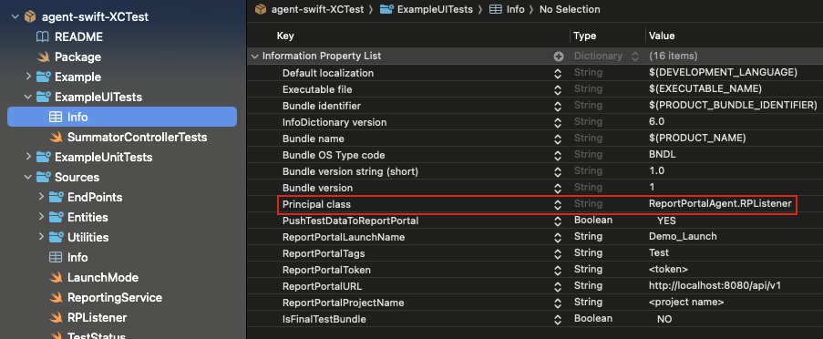
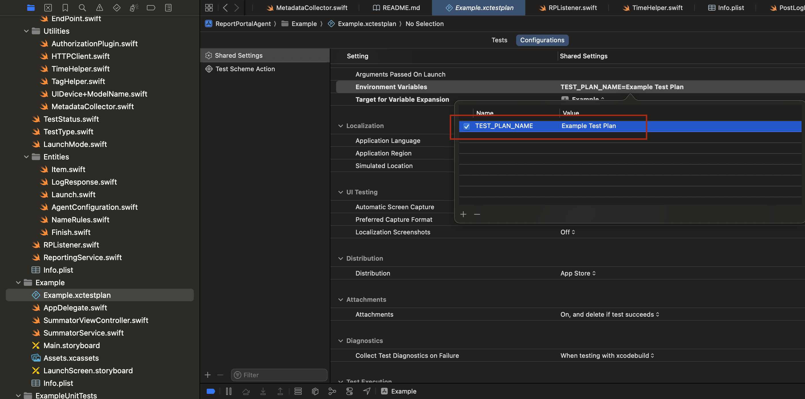

# XCTest Agent for ReportPortal


[](http://cocoapods.org/pods/ReportPortal)
[](http://cocoapods.org/pods/ReportPortal)
[](https://github.com/reportportal/agent-swift-XCTest/actions/workflows/validate.yml)
[](https://slack.epmrpp.reportportal.io/)
[](http://stackoverflow.com/questions/tagged/reportportal)
[](http://reportportal.io?style=flat)
[](https://opensource.org/licenses/Apache-2.0)

## Installation

ReportPortalAgent is available through [CocoaPods](http://cocoapods.org). To install
it, simply add the following line to your Podfile:

```ruby
pod 'ReportPortal'
```
and install it:
```bash
cd <project>
pod install
```

Also available through SPM by name "agent-swift-xctest" or URL of current repo

## Report Portal properties

The properties for Report Portal configuration should be set in the `Info.plist` file of your Test Target. If you Test Target does't have an `Info.plist`, follow these steps to add:

1. In your Test Target Folder, create a Property List named `Info.plist`.
2. In Test Target Settings, configure 'Info.plist File' with the path `TestTargetFolderName/Info.plist`.

Now, you can specify the Report Portal properties:

* ReportPortalURL - URL to API of report portal (exaple https://report-portal.company.com/api/v1).
* ReportPortalToken - token for authentication which you can get from RP account settings.
* ReportPortalLaunchName - name of launch.
* Principal class - use `ReportPortalAgent.RPListener` from ReportPortalAgent lib for SPM or `ReportPortal.RPListener` for CocoaPods. You can also specify your own Observer which should conform to [XCTestObservation](https://developer.apple.com/documentation/xctest/xctestobservation) protocol.
* PushTestDataToReportPortal - can be used to switch off/on reporting
* ReportPortalProjectName - project name from Report Portal
* ReportPortalTags(optional) - can be used to specify tags, separated by comma.

Example:


## Optional: Test Plan Name visibility

To include test plan names in ReportPortal, add the `TEST_PLAN_NAME` environment variable to your `.xctestplan` file manually:

```json
{
  "defaultOptions": {
    "environmentVariableEntries": [
      {
        "key": "TEST_PLAN_NAME",
        "value": "Example Test Plan"
      }
    ]
  }
}
```
Or in XCode:


**Result:** Launch names will appear as `YourLaunchName: Example_Test_Plan` in ReportPortal.

**Note:** Spaces in test plan names are automatically replaced with underscores for better compatibility.

**CI Override:** CI can override this value: `TEST_PLAN_NAME="Nightly Tests" xcodebuild test ...`

## Parallel Test Execution (v4.0+)

Starting with v4.0, the agent fully supports **parallel test execution**, allowing you to dramatically reduce CI/CD pipeline times. Tests can be executed across multiple simulator instances simultaneously while maintaining proper test hierarchy and reporting in ReportPortal.

### Requirements

- **iOS 15.0+** / **macOS 12.0+** (required for Swift Concurrency)
- **Swift 5.5+**
- **Xcode 13+**

### Configuration

#### 1. Enable Parallel Execution in Test Plan

Edit your `.xctestplan` file to enable parallelization:

```json
{
  "defaultOptions": {
    "parallelizationEnabled": true,
    "maximumParallelTestExecutionWorkers": 4
  },
  "testTargets": [
    {
      "parallelizable": true,
      "target": {
        "containerPath": "container:YourProject.xcodeproj",
        "identifier": "YOUR_TEST_TARGET_ID",
        "name": "YourUITests"
      }
    }
  ]
}
```

#### 2. Run Tests with Parallel Execution

**Option A: Single Device Type (Multiple Clones)**

This approach clones the same simulator multiple times. Best for consistent test environments:

```bash
xcodebuild test \
  -scheme YourScheme \
  -testPlan YourTestPlan \
  -destination 'platform=iOS Simulator,name=iPhone 16' \
  -parallel-testing-enabled YES \
  -maximum-parallel-testing-workers 4
```

This will create 4 simulator clones: `iPhone 16 - Clone 1`, `iPhone 16 - Clone 2`, etc.

**Option B: Multiple Device Types (Explicit Devices)**

Run tests across different device models simultaneously. Great for device coverage:

```bash
xcodebuild test \
  -scheme YourScheme \
  -testPlan YourTestPlan \
  -destination 'platform=iOS Simulator,name=iPhone 16' \
  -destination 'platform=iOS Simulator,name=iPhone 15 Pro' \
  -destination 'platform=iOS Simulator,name=iPhone 15' \
  -destination 'platform=iOS Simulator,name=iPhone 14' \
  -parallel-testing-enabled YES
```

**Option C: GitHub Actions Example**

```yaml
- name: Run Tests in Parallel
  run: |
    xcodebuild test \
      -scheme MyApp \
      -testPlan MyTestPlan \
      -destination 'platform=iOS Simulator,name=iPhone 16' \
      -parallel-testing-enabled YES \
      -maximum-parallel-testing-workers 2 \
      -resultBundlePath TestResults.xcresult
```

**Option D: Bitrise Example**

```yaml
- xcode-test@4:
    inputs:
      - scheme: MyApp
      - test_plan: MyTestPlan
      - simulator_device: iPhone 16
      - xcpretty_test_options: --parallel-testing-enabled --maximum-parallel-testing-workers 3
```

### Worker Count Recommendations

Choose worker count based on your CI/CD environment:

| Environment | Recommended Workers | Reasoning |
|-------------|---------------------|-----------|
| **Local Development** (8+ cores) | 4 | Balanced performance without overloading machine |
| **Local Development** (4-6 cores) | 2-3 | Prevents resource contention |
| **GitHub Actions** | 2 | Limited CI resources (7GB RAM, 2 cores) |
| **Bitrise** | 3-4 | Better resource availability |
| **Jenkins** (self-hosted) | CPU count / 2 | Scale with available hardware |
| **GitLab CI** | 2-3 | Standard runner specs |

### Verifying Parallel Execution

When tests run in parallel, you should see output like:

```
Testing started on 'iPhone 16 - Clone 1'
Testing started on 'iPhone 16 - Clone 2'
Testing started on 'iPhone 16 - Clone 3'
Testing started on 'iPhone 16 - Clone 4'
```

In ReportPortal, all test results will appear under a **single launch** with proper test hierarchy maintained.

### Performance Impact

**Example: 1000 UI tests @ 3 seconds each**

| Configuration | Execution Time | Improvement |
|--------------|----------------|-------------|
| Sequential (v3.x) | ~50 minutes | Baseline |
| Parallel - 2 workers | ~25 minutes | **50% faster** |
| Parallel - 4 workers | ~15 minutes | **70% faster** |

### Troubleshooting

**Issue: Tests still run sequentially**

Check that:
- Test plan has `"parallelizationEnabled": true`
- Test targets have `"parallelizable": true`
- Command line includes `-parallel-testing-enabled YES`

**Issue: Only 1 simulator visible**

The agent supports parallel execution, but simulator visibility depends on xcodebuild. Verify with:
```bash
instruments -s devices  # Should show cloned simulators during test run
```

**Issue: Flaky tests in parallel mode**

- Run with Thread Sanitizer to detect race conditions: `-enableThreadSanitizer YES`
- Check for shared state between tests (static variables, singletons)
- Use proper waits instead of hard-coded delays (`XCTAssertTrue(element.waitForExistence(timeout: 5))`)

### Sequential Execution (Backward Compatible)

To run tests sequentially (v3.x behavior):

```json
{
  "defaultOptions": {
    "parallelizationEnabled": false
  }
}
```

Or via command line:
```bash
xcodebuild test -scheme YourScheme -parallel-testing-enabled NO
```

---

## 📚 Documentation

This README serves as the central hub for all documentation. Below are links to detailed guides organized by audience.

### For End Users

| Document | Description |
|----------|-------------|
| **[CHANGELOG.md](./CHANGELOG.md)** | Release history, version notes, and change log |

### For Developers & Contributors

| Document | Description |
|----------|-------------|
| **[ARCHITECTURE.md](./ARCHITECTURE.md)** | Deep dive into system architecture, concurrency model, actor design, sequence diagrams, and design rationale |
| **[specs/001-parallel-execution/spec.md](./specs/001-parallel-execution/spec.md)** | Feature specification: requirements, user stories, acceptance criteria, and success metrics |
| **[specs/001-parallel-execution/plan.md](./specs/001-parallel-execution/plan.md)** | Implementation plan: technical context, phase breakdown, and constitution compliance check |
| **[specs/001-parallel-execution/tasks.md](./specs/001-parallel-execution/tasks.md)** | Task breakdown: 31 implementation tasks with dependencies, acceptance criteria, and parallel execution opportunities |
| **[specs/001-parallel-execution/research.md](./specs/001-parallel-execution/research.md)** | Research notes: Swift Concurrency patterns, Actor model investigation, and technical decisions |
| **[specs/001-parallel-execution/data-model.md](./specs/001-parallel-execution/data-model.md)** | Data model design: entity definitions, state management, and relationships |
| **[specs/001-parallel-execution/quickstart.md](./specs/001-parallel-execution/quickstart.md)** | Developer quickstart guide for understanding and extending parallel execution features |

### API Contracts (Internal)

| Document | Description |
|----------|-------------|
| **[specs/001-parallel-execution/contracts/LaunchManager.md](./specs/001-parallel-execution/contracts/LaunchManager.md)** | LaunchManager Actor API: methods, state management, and concurrency guarantees |
| **[specs/001-parallel-execution/contracts/OperationTracker.md](./specs/001-parallel-execution/contracts/OperationTracker.md)** | OperationTracker Actor API: operation registry, lifecycle management |
| **[specs/001-parallel-execution/contracts/ReportingService.md](./specs/001-parallel-execution/contracts/ReportingService.md)** | ReportingService async API: ReportPortal communication layer |

### Quick Links

- **Getting Started**: See [Installation](#installation) and [Report Portal properties](#report-portal-properties) above
- **Parallel Execution Setup**: See [Parallel Test Execution (v4.0+)](#parallel-test-execution-v40) section
- **Architecture Overview**: Start with [ARCHITECTURE.md](./ARCHITECTURE.md) for diagrams and design decisions
- **Contributing**: Review [specs/001-parallel-execution/](./specs/001-parallel-execution/) for development context

---

## Authors
ReportPortal Team, <support@reportportal.io>

[@rusel95](https://github.com/rusel95), <ruslanpopesku95@gmail.com>

@DarthRumata, <stas.kirichok@windmill.ch> ([Windmill Smart Solutions](https://github.com/Windmill-Smart-Solutions))

@SergeVKom, <sergvkom@gmail.com> (original library)

## License

Licensed under the [Apache 2.0](https://www.apache.org/licenses/LICENSE-2.0) license (see the LICENSE file).
